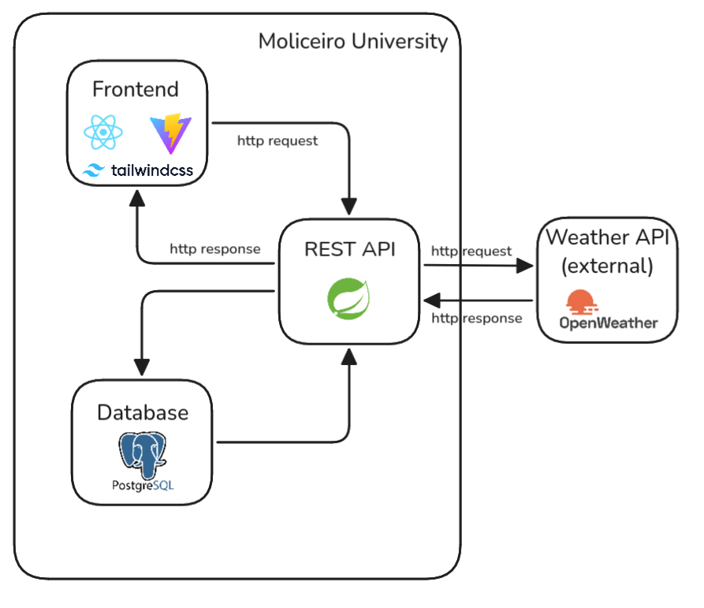
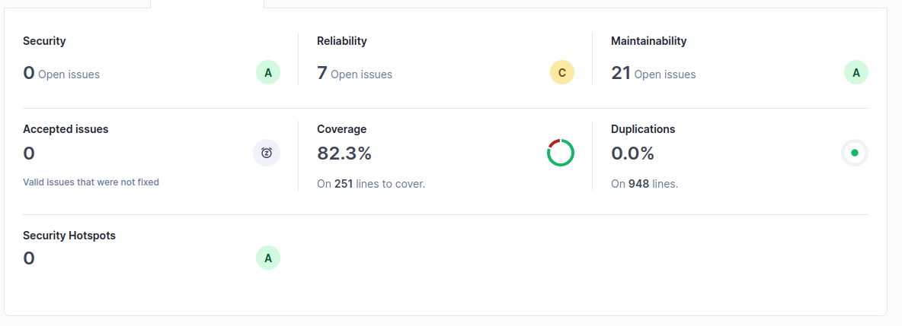

# Moliceiro University


## Trabalho realizado por:
- Abel Teixeira; LEI; Nº 113655

--- 

## Estrutura
| Camada           | Tecnologias                                  |
|------------------|----------------------------------------------|
| **Backend**      | Java 21, Spring Boot 3.4.4, Maven, PostgreSQL|
| **Frontend**     | React 19, TypeScript, Vite, Tailwind CSS, ShadcnUI|
| **Testes**       | JUnit 5, Mockito, Selenium, k6               |
| **Infrastrutura**| Docker, Docker Compose                       |

---



---
### Como executar o Projeto

Na pasta root do projeto, executar o comando:

```bash
docker compose up -d --build
```

O backend está disponivel na porta :8081 e o frontend :3000.

### Frontend:

O frontend está disponível na seguinte URL: http://localhost:3000

### API para desenvolvolvedores:
A API está disponível na seguinte URL: http://localhost:8081/swagger-ui/index.html

## Testes Realizados:

### Testes Unitários e de Service Level (com Mocks):

Os testes unitários foram realizados com recurso à biblioteca ```JUnit 5```, que permite realizar testes de unidade e de integração, utilizando mocks para simular o comportamento de componentes externos.
Os testes de service level foram realizados com recurso à biblioteca ```Mockito```, que permite criar mocks de classes e interfaces, facilitando a simulação de comportamentos e a verificação de interações.

**Configuração utilizada:**
- JUnit 5
- Mockito

**Cobertura de Testes:**
- DTOs
  - MealWithWeatherDTO
  - ReservationRequestDTO
  - ReservationResponseDTO

- Serviços
  - ReservationService
  - WeatherService

---

### Testes de Integração (Spring Boot + MockMvn):

Os testes de integração foram realizados com recurso à biblioteca ```Spring Boot Test```, que permite realizar testes de integração com o contexto do Spring Boot, utilizando o MockMvn para simular o comportamento de componentes externos.

**Configuração utilizada:**
- Spring Boot Test
- MockMvn

**Cobertura de Testes:**
- Controladores
  - RestaurantController
  - ReservationController

---

### Testes Funcionais (BDD, Selenium WebDriver)

Os testes funcionais foram realizados com recurso à ferramenta ```Selenium WebDriver```, que permite simular a interação do utilizador com a aplicação, verificando se o comportamento da aplicação está de acordo com as especificações.

---

### Testes de Desempenho (Grafana k6)

Os testes de desempenho/performance foram realizados com a ferramenta ```Grafana k6```, que permite simular múltiplos utilizadores a interagir com a aplicação, medindo o tempo de resposta e a taxa de sucesso das requisições.

**Configuração utilizada:**
- 100 utilizadores virtuais (VUs) durante 10 segundos no teste dos GETs
- 20 utilizadores virtuais (VUs) durante 10 segundos no teste dos POSTs

**Resultados dos testes:**

Para executar os testes, utilize o seguinte comando no diretorio ``` backend/src/test/performance```:

```bash
k6 run PerformanceGetTest.js
k6 run PerformancePostTest.js
```

**Resultados do teste GET:**
```java
  █ TOTAL RESULTS 

    checks_total.......................: 58906  5883.349393/s
    checks_succeeded...................: 99.99% 58905 out of 58906
    checks_failed......................: 0.00%  1 out of 58906

    ✓ GET /restaurants - status 200
    ✗ GET /meals - status 200
      ↳  99% — ✓ 29452 / ✗ 1

    HTTP
    http_req_duration.......................................................: avg=16.84ms min=827.66µs med=10.27ms max=1.06s p(90)=30.98ms p(95)=44.08ms
      { expected_response:true }............................................: avg=16.83ms min=827.66µs med=10.27ms max=1.06s p(90)=30.98ms p(95)=44.07ms
    http_req_failed.........................................................: 0.00%  1 out of 58906
    http_reqs...............................................................: 58906  5883.349393/s

    EXECUTION
    iteration_duration......................................................: avg=33.95ms min=2.8ms    med=24.68ms max=1.35s p(90)=54.37ms p(95)=72.48ms
    iterations..............................................................: 29453  2941.674696/s
    vus.....................................................................: 100    min=100        max=100
    vus_max.................................................................: 100    min=100        max=100

    NETWORK
    data_received...........................................................: 89 MB  8.9 MB/s
    data_sent...............................................................: 6.0 MB 603 kB/s


running (10.0s), 000/100 VUs, 29453 complete and 0 interrupted iterations
default ✓ [======================================] 100 VUs  10s
```

**Resultado do teste POST:**
```java
  █ TOTAL RESULTS 

    checks_total.......................: 32811  3278.978193/s
    checks_succeeded...................: 89.27% 29292 out of 32811
    checks_failed......................: 10.72% 3519 out of 32811

    ✗ status esperado (2xx/4xx)
      ↳  89% — ✓ 29292 / ✗ 3519

    HTTP
    http_req_duration.......................................................: avg=5.88ms min=1.73ms med=5.47ms max=124.18ms p(90)=8.32ms p(95)=9.53ms
      { expected_response:true }............................................: avg=6.01ms min=2.04ms med=5.5ms  max=124.18ms p(90)=8.15ms p(95)=9.4ms 
    http_req_failed.........................................................: 61.16% 20070 out of 32811
    http_reqs...............................................................: 32811  3278.978193/s

    EXECUTION
    iteration_duration......................................................: avg=6.08ms min=1.82ms med=5.66ms max=125.22ms p(90)=8.57ms p(95)=9.81ms
    iterations..............................................................: 32811  3278.978193/s
    vus.....................................................................: 20     min=20             max=20
    vus_max.................................................................: 20     min=20             max=20

    NETWORK
    data_received...........................................................: 9.8 MB 980 kB/s
    data_sent...............................................................: 6.8 MB 676 kB/s


running (10.0s), 00/20 VUs, 32811 complete and 0 interrupted iterations
default ✓ [======================================] 20 VUs  10s

```

## SonarQube
A análise de código está disponível na seguinte URL: http://localhost:9000

```bash
mvn clean verify sonar:sonar \
  -Dsonar.projectKey=hw1 \
  -Dsonar.projectName='hw1' \
  -Dsonar.host.url=http://localhost:9000 \
  -Dsonar.token=${token}
```

