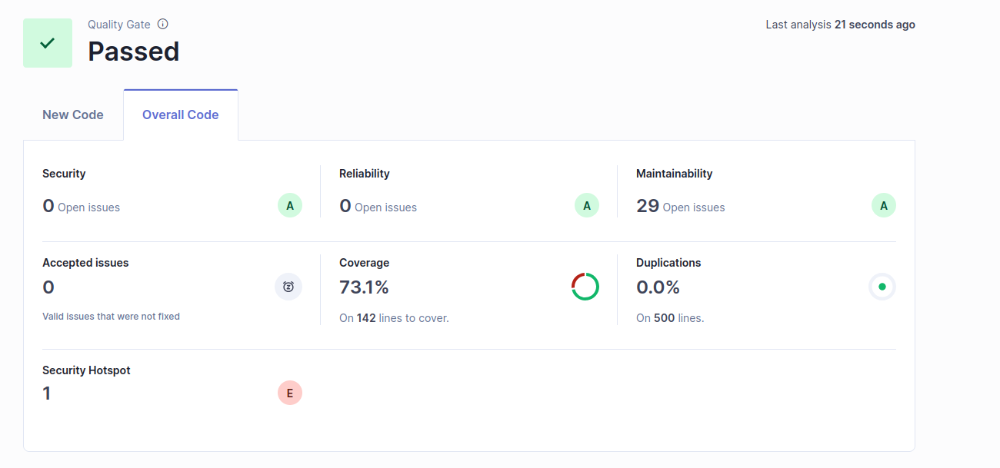

# Lab08 - Código Limpo e Análise Estática

Este laboratório foca-se em **análise estática de código** e **boas práticas de código limpo**, utilizando ferramentas como SonarQube. Aprenderás a avaliar métricas de qualidade de código, gerir dívida técnica e realizar revisões de código assistidas por IA.

---

## Objetivos de Aprendizagem
- Utilizar análise estática para inspecionar métricas de qualidade (bugs, vulnerabilidades, "code smells").
- Configurar o SonarQube localmente via Docker para monitorização de código.
- Analisar dívida técnica e cobertura de testes em projetos Java.
- Realizar revisões de código com assistência de IA (ex.: GitHub Copilot).

---

## Conceitos-Chave

### **Análise Estática de Código**
- **SonarQube**: Plataforma para inspeção contínua da qualidade do código (bugs, vulnerabilidades, más práticas).
- **Dívida Técnica**: Esforço estimado para corrigir problemas (medido em horas/dias).
- **Portões de Qualidade (Quality Gates)**: Regras para garantir padrões mínimos de qualidade (ex.: cobertura ≥ 80%, zero bugs críticos).

### **Ferramentas e Métricas**
- **JaCoCo**: Plugin para medição de cobertura de testes em projetos Maven/Gradle.
- **Checkstyle/PMD/SpotBugs**: Ferramentas de análise estática integradas ao SonarQube.
- **Métricas Principais**:
  - **Confiabilidade**: Bugs e vulnerabilidades.
  - **Manutenibilidade**: Complexidade e "code smells".
  - **Cobertura**: Linhas/condições cobertas por testes.

---

## Exercícios

### 8.1 Análise Local com SonarQube

#### a) Preparar um Projeto Java
- Utilize um projeto Maven (ex.: "Euromillions" do Lab 1.2).
- Configure o JaCoCo no `pom.xml` para medir cobertura de testes.

#### b) Executar SonarQube via Docker
```bash
docker run -d --name sonarqube -e SONAR_ES_BOOTSTRAP_CHECKS_DISABLE=true -p 9000:9000 sonarqube:latest
```
- Acesse o painel em ```http://localhost:9000``` (credenciais: admin/admin).
- Altere a senha padrão e crie um novo projeto.

#### c) Configurar Análise no SonarQube

- Gere um token de projeto no SonarQube.
- Execute o comando Maven para análise (substitua os placeholders):

```bash
mvn clean verify sonar:sonar \
  -Dsonar.projectKey=eurom1 \
  -Dsonar.host.url=http://localhost:9000 \
  -Dsonar.token={token}
```

#### g) Analisar Resultados



| **Issue**          | **Problem description**                                           | **How to solve**                                        |
|--------------------|-------------------------------------------------------------------|---------------------------------------------------------|
| Security           | Nenhum problema encontrado.                                       | —                                                       |
| Reliability        | Nenhum problema encontrado.                                       | —                                                       |
| Maintainability    | Nomes de variáveis pouco descritivos                              | Utilizar nomes mais descritivos                         |
| Maintainability    | Possível código repetido em diferentes métodos                    | Criar métodos auxiliares                                |
| Security Hotspot   | Potencial risco de exposição a dados externos                     | Validar inputs externos                                 |


#### Recursos Úteis
- [SonarQube Documentation](https://docs.sonarqube.org/latest/)
- [JaCoCo Documentation](https://www.jacoco.org/jacoco/trunk/doc/maven.html)
- [Checkstyle Documentation](https://checkstyle.sourceforge.io/)
- [PMD Documentation](https://pmd.github.io/)
